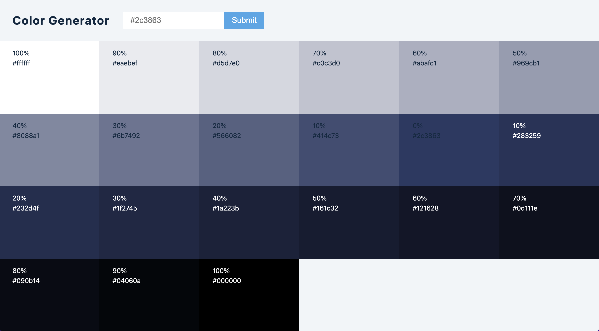

<h1 align="center">Welcome to the React Ipsum Lorem Generator Project 👋</h1>

  
  
  

### Screenshot

### Links

- Solution URL: [Github](https://github.com/MSPayneII/fem-nft-card-component)
- Live Site URL: [Netlify](https://mspayneii-react-color-generator.netlify.app/)

## Reason for choosing this project:

This was a simple hands-on React project provided by John Smilga as part of his Udemy React Tutorial and Projects Course. This project was designed to help students become familiar with forms, useState, and React in general.

## Functionality:

The application serves as a color generator for hexadecimal color codes. The user enters a hexadecimal color code of their choosing. Once the user clicks "submit," the application will display a spectrum of the color's lightness and darkness.

- The first ten boxes show the spectrum of tint from 100% - 10%
- The 11th box represents the base color with 0% tint and 0% shade
- The last ten boxes show the spectrum of shade from 0% - 100%

Users can save a color box hexadecimal code to their clipboard by simply clicking the color box they want. They will receive a notification informing them that the code is copied, which will disappear after 3 seconds.

## Technologies:

- React
- [Values.js](https://github.com/noeldelgado/values.js)

## Author

- Website - [Michael Payne](https://michaelspayneii.com/)
- Frontend Mentor - [@MSPayneII](https://www.frontendmentor.io/profile/MSPayneII)
- Github - [MSPayneII](https://github.com/MSPayneII)
